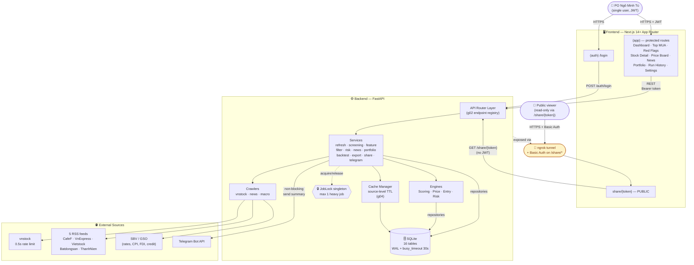

# 01 — System Context

Boundary cao nhất: ai dùng hệ thống, hệ thống gồm gì, kết nối ra ngoài thế nào.

## Diagram

## Notes

- **Single user MVP:** chỉ 1 PO duy nhất login bằng password → nhận JWT 24h. Public viewer của `/share/{token}` không có session, được bảo vệ bởi ngrok Basic Auth ở production (xem [c06 §8](../tad/c06-pdf-share.md)).
- **External 4 nhóm:** vnstock (price + financials), 5 RSS news, SBV/GSO macro, Telegram outbound. Refresh chỉ chạy thủ công 1 lần/ngày — screening **không** fetch external (xem [g01 §1](../tad/g01-runtime.md)).
- **Job lock** ngăn refresh/screening/backtest chạy đồng thời — chi tiết [diagram 07](07-cache-cross-cutting.md) và [g05 §1](../tad/g05-cross-cutting.md).
