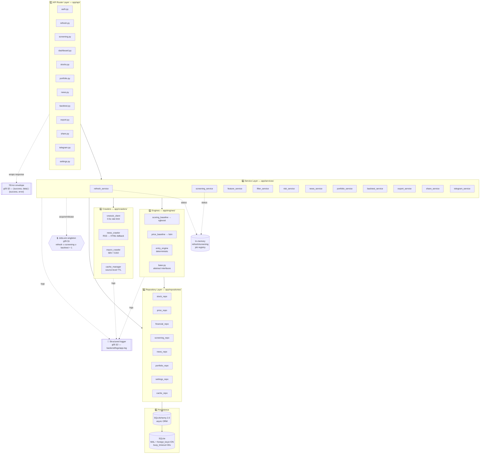
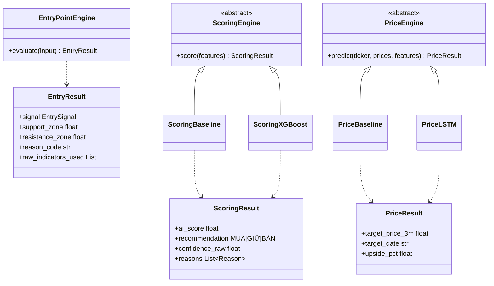

# 02 — Backend Layers

Layer pattern bắt buộc: **API Router → Service → Repository → SQLAlchemy → SQLite**. KHÔNG query SQL trực tiếp trong Services ([TAD 00 §3](../tad/00-tad-system-overview.md)).

## Layered architecture

## Engine interfaces (c01)

## Notes

- Layer rule cứng: **API → Service → Repository**. Không skip — tránh logic kinh doanh leak vào router hoặc SQL leak vào service.
- **Engines** là module pluggable: MVP dùng `*_baseline.py`, target swap sang `*_xgboost.py` / `*_lstm.py` mà KHÔNG đổi UI/API contract (xem [c01 §2](../tad/c01-engines.md)).
- **EntryPointEngine** không abstract — logic deterministic theo SRS-03 priority order (xem [c03](../tad/c03-entry-engine.md)).
- **JobLock** + **In-memory job registry** giữ trạng thái refresh/screening đang chạy. Restart backend = mất status (acceptable cho MVP, không persist vào table).
