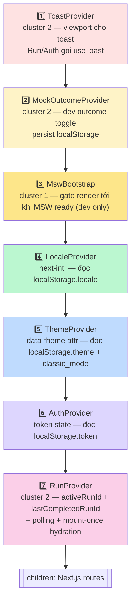
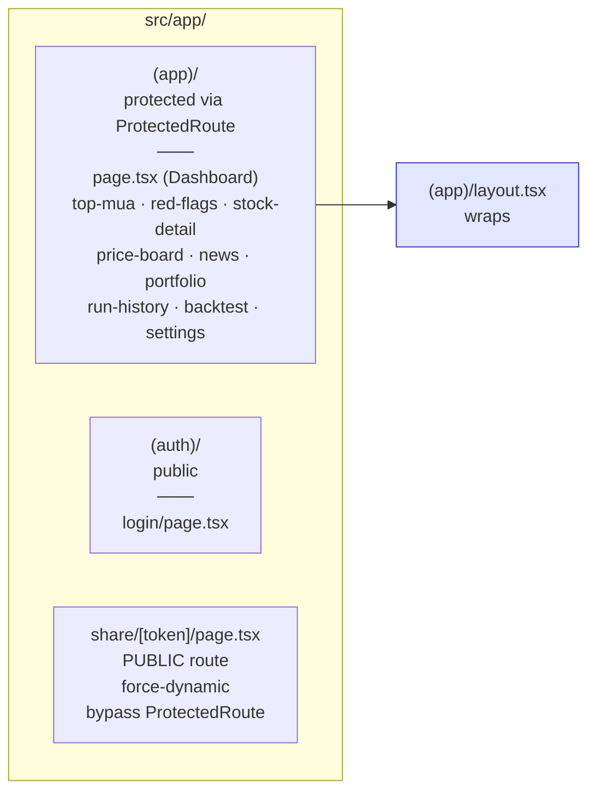
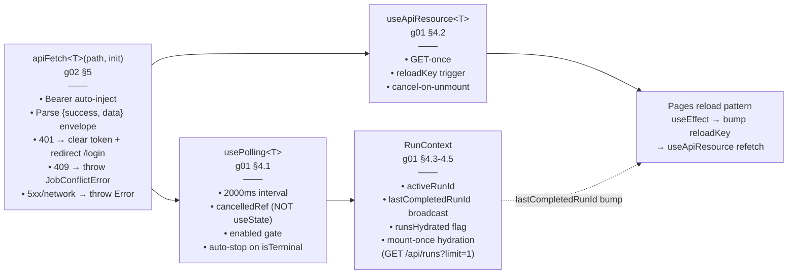
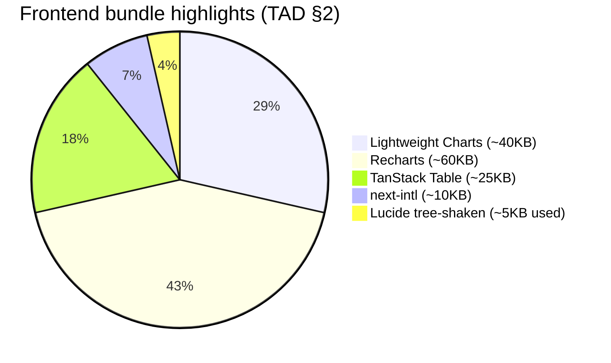
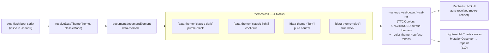

# 03 — Frontend Stack

Next.js 16.2.6 App Router + Turbopack (default, không còn `--webpack`). Single-user MVP, không SSR session — auth + theme + locale persist trong `localStorage`.

## Provider stack — 7 layers (cluster 2)

Outer → inner. Mỗi layer cần outer hơn consumer của nó.

**Order rationale (g05 §4):**

| Layer | Tại sao ở vị trí này |
|---|---|
| Toast | Outermost vì Run + Auth call `useToast()` |
| MockOutcome | Outer than Auth → dev tester toggle outcome trước khi login |
| MswBootstrap | Outer than network-callers → MSW phải start trước mọi `apiFetch` |
| Locale | Outer than Theme → label theme switcher hiển thị theo locale |
| Theme | Outer than Auth → toàn app (kể cả `/login`) có theme đúng |
| Auth | Outer than Run → RunProvider check token validity trước khi gọi `/api/run` |
| Run | Innermost — mọi page dùng `useRun()` |

## Route groups

## Key hooks & utilities

## Bundle composition (cluster 1-3)

## Theme system (c09)

## Notes

- **localStorage keys** (g03 §L Frontend Constants): `token`, `theme`, `classic_mode`, `locale`, `stock-v2:candlestick-ma-toggles`, `stock-v2:section:{key}` (CollapsibleSection).
- **Cluster 6 dự kiến** thêm `<ShareProvider>` cho `/share/[token]` public route (xem [g05 §4](../tad/g05-cross-cutting.md)).
- **MSW** chỉ chạy ở `NODE_ENV=development`. Production frontend gọi backend FastAPI thực qua `NEXT_PUBLIC_API_URL` — `apiFetch` không cần đổi (xem [g05 §5](../tad/g05-cross-cutting.md)).
- **Stock Detail candlestick** dùng pattern riêng vì canvas không follow CSS vars — chi tiết [c10](../tad/c10-stock-detail-chart.md) (MutationObserver + 2-tier selector + MA overlays + 1500-day padding + multiplicative scaling).
