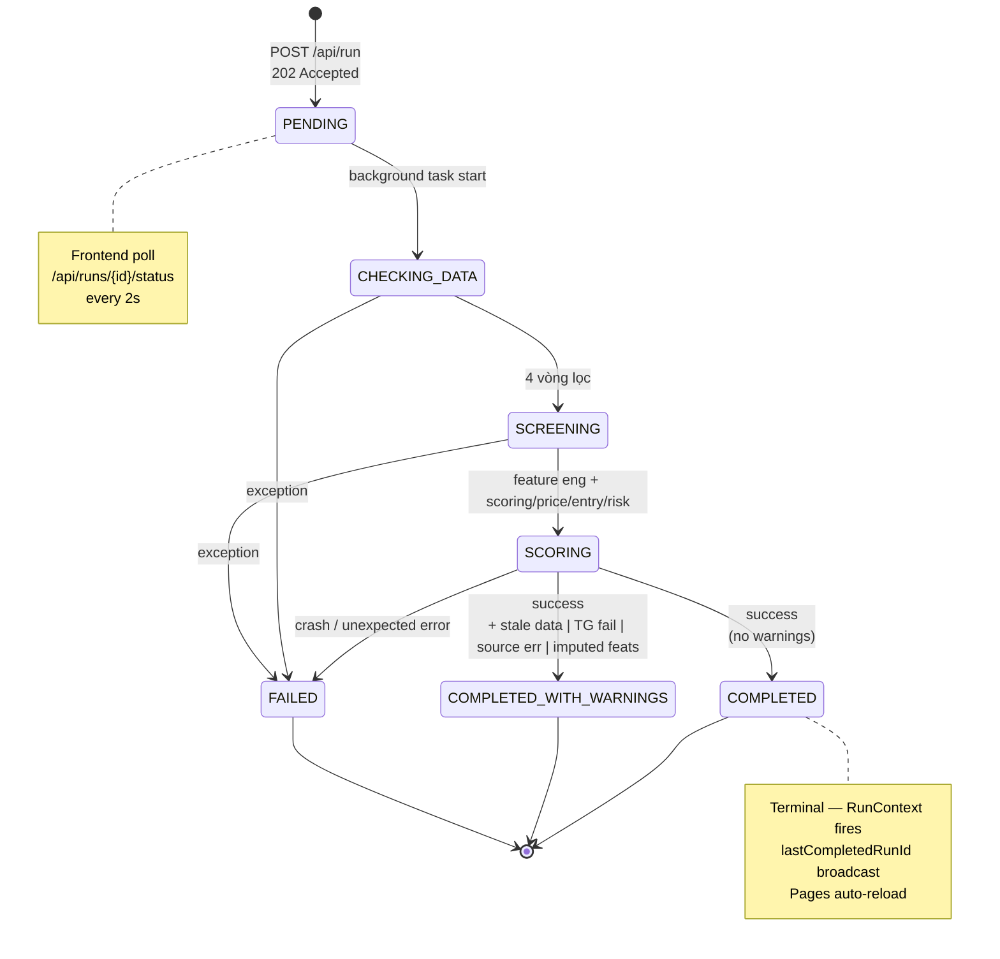
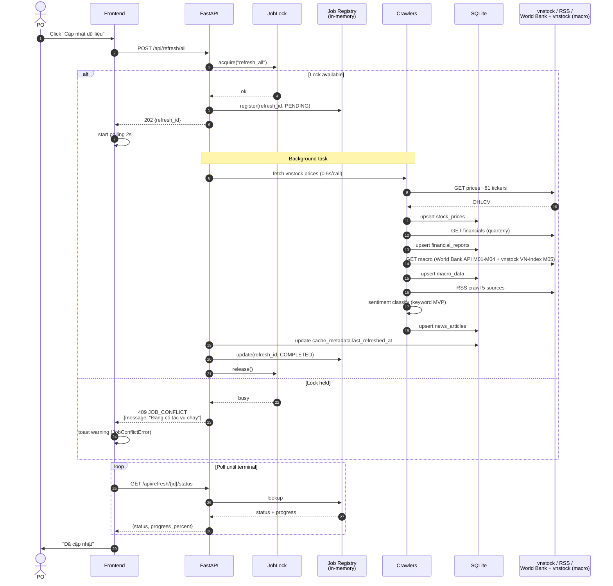
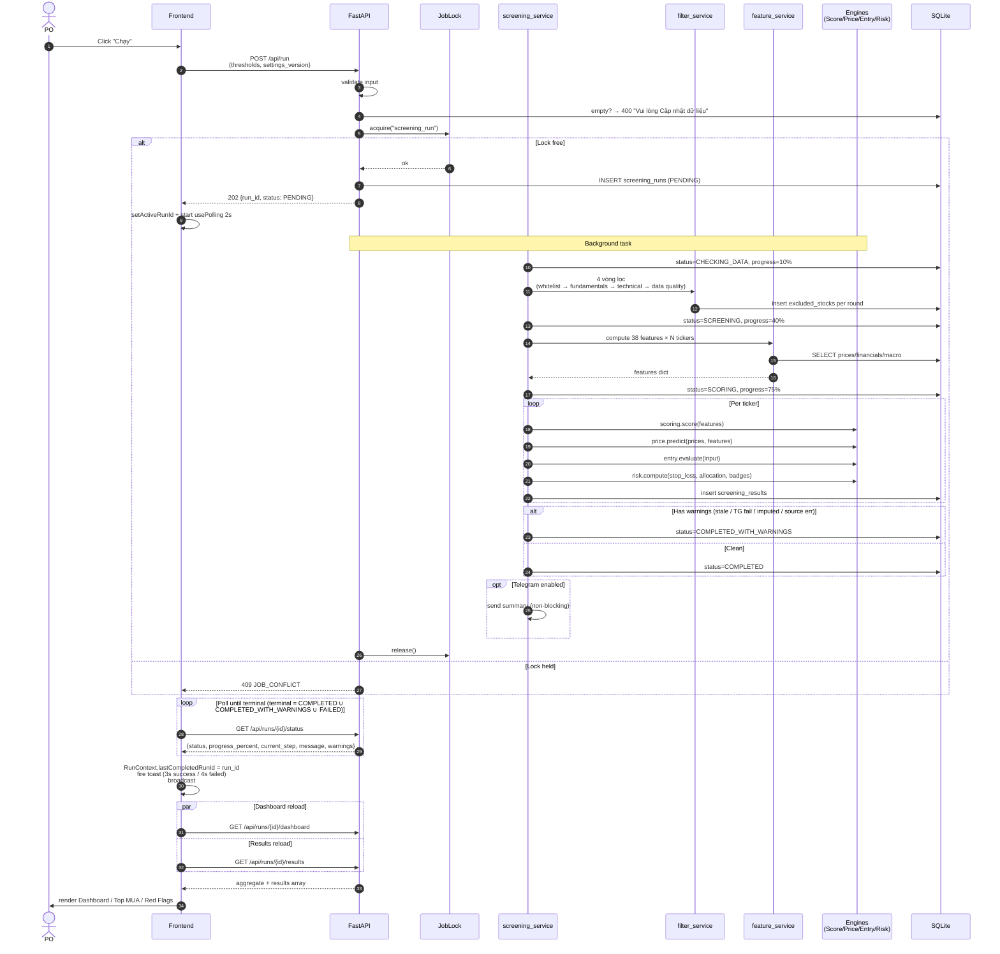
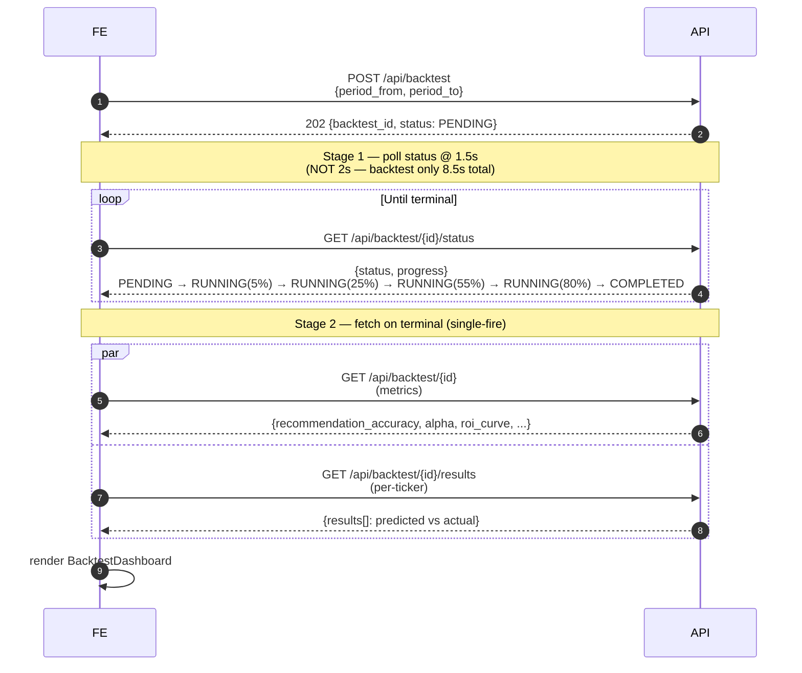
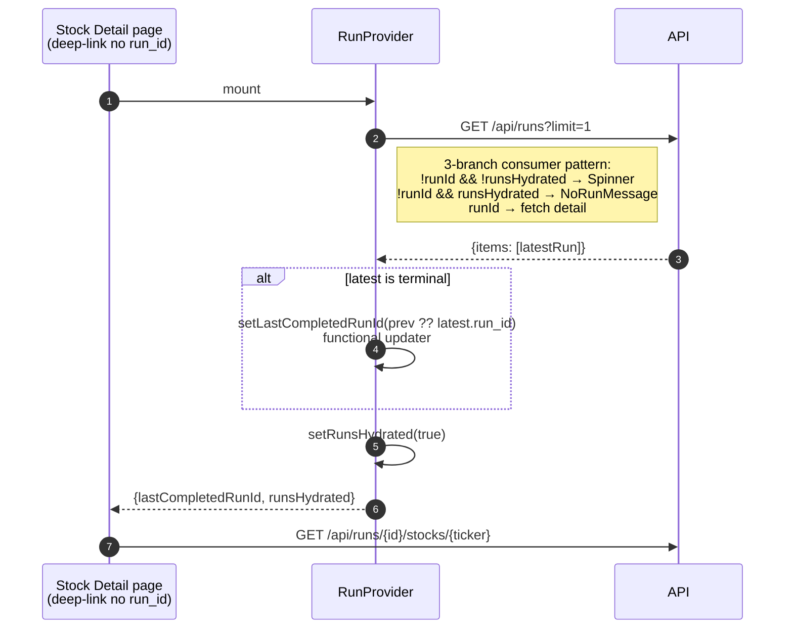

# 04 — Runtime Flows

Two-Flow Architecture: **Refresh** (1 lần/ngày, fetch external) vs **Screening** (đọc DB/cache, KHÔNG fetch). Chi tiết [g01 §1](../tad/g01-runtime.md).

## Run state machine — 7 states (g01 §2.1)

> SRS g03 Appendix simplified view = `RUNNING / COMPLETED / FAILED`. Implementation 7 states ở trên là canonical. `RUNNING` trong SRS = `CHECKING_DATA ∪ SCREENING ∪ SCORING`.

## Refresh flow (g01 §1 Flow 1)

## Screening flow (g01 §1 Flow 2)

## Backtest 2-stage polling (g02 §8.5)

## RunContext mount-once hydration (g01 §4.5)

## Notes

- **Job lock** scope: refresh ∪ screening ∪ backtest = **chỉ 1** chạy đồng thời. Vi phạm → 409 + `JobConflictError` ở FE (xem [g05 §1](../tad/g05-cross-cutting.md)).
- **Polling interval**: screening = 2000ms; backtest = 1500ms (chỉ 8.5s total → 2s tick chỉ 4 lần, jump rời rạc); refresh = 2000ms.
- **`cancelledRef` pattern**: `usePolling` dùng `useRef` (KHÔNG `useState`) để chống late-fire sau unmount (xem [g01 §4.1](../tad/g01-runtime.md)).
- **Functional setState ở dismiss timer**: chống race khi user start run mới trước khi timer fire — captured runId vs current state (xem [g01 §4.4](../tad/g01-runtime.md)).
