# 05 — Database ERD

SQLite, 16 tables, WAL + foreign_keys=ON. Migration-ready PostgreSQL (TEXT→VARCHAR, *_json→JSONB). Chi tiết DDL: [g03](../tad/g03-database.md).

## Diagram

```mermaid
erDiagram
    stocks ||--o{ stock_prices : "ticker"
    stocks ||--o{ financial_reports : "ticker"
    stocks ||--o{ portfolio : "ticker"
    stocks ||--o{ screening_results : "ticker"

    screening_runs ||--o{ screening_results : "run_id"
    screening_runs ||--o{ excluded_stocks : "run_id"
    screening_runs ||--o{ share_links : "run_id"

    backtest_runs ||--o{ backtest_results : "backtest_id"

    stocks {
        text ticker PK
        text name
        text exchange
        text sector
        text status "ACTIVE"
        bool newly_listed
        ts created_at
        ts updated_at
    }

    stock_prices {
        int id PK
        text ticker FK
        date date
        real open
        real high
        real low
        real close
        int volume
        real ceiling
        real floor
        real reference
        ts cached_at
    }

    financial_reports {
        int id PK
        text ticker FK
        text period
        int year
        int quarter
        real revenue
        real net_income
        real total_assets
        real total_equity
        real total_debt
        real current_assets
        real current_liabilities
        real inventory
        real cogs
        real operating_cash_flow
        real eps
        real bvps
        real advances
        int shares_outstanding
        text audit_opinion
        ts cached_at
    }

    macro_data {
        int id PK
        text indicator
        text period
        real value
        text source
        ts cached_at
    }

    screening_runs {
        text run_id PK
        ts run_at
        text status "7-state enum"
        text model_version "baseline_v1|v2"
        int settings_version
        real total_capital
        text thresholds_json
        bool data_from_cache
        int total_input
        int after_round_1
        int after_round_2
        int after_round_3
        int after_round_4
        int scored_count
        int buy_count
        int hold_count
        int sell_count
        text warnings_json
        bool telegram_sent
        text telegram_error
        text run_error
        real duration_seconds
        text current_step
        int progress_percent
        ts completed_at
        ts created_at
    }

    screening_results {
        int id PK
        text run_id FK
        text ticker FK
        real ai_score
        text recommendation "MUA|GIỮ|BÁN"
        real confidence_raw
        int confidence_penalty
        real confidence
        real target_price_3m
        real current_price
        real upside_pct
        text entry_signal
        text entry_reason_code
        real support_zone
        real resistance_zone
        real stop_loss_price
        real allocation_amount
        real allocation_weight
        text warning_badges_json
        text reasons_json
        text feature_values_json
        int feature_availability
        text radar_json
        ts created_at
    }

    excluded_stocks {
        int id PK
        text run_id FK
        text ticker
        int excluded_round "1-4"
        text reason
        text reason_code
    }

    news_articles {
        int id PK
        text source "5 RSS sources"
        text title
        text url UK
        ts published_at
        text content_snippet
        text related_tickers_json
        text sentiment_label "POS|NEU|NEG"
        real sentiment_score "-1..+1"
        text sentiment_reason
        ts crawled_at
    }

    user_profile {
        int id PK "default 1"
        text name
        text email
        text password_hash "bcrypt"
        ts created_at
        ts updated_at
    }

    portfolio {
        int id PK
        text ticker FK
        int quantity ">0"
        real buy_price ">0"
        date buy_date
        text notes
        ts created_at
        ts updated_at
    }

    transactions {
        int id PK "Post-MVP"
        text ticker
        text action
        int quantity
        real price
        date date
        text based_on_run_id
        ts created_at
    }

    settings {
        int id PK "default 1"
        int version "1|2"
        int buy_threshold "75"
        int hold_min_threshold "45"
        real default_capital
        bool source_cafef
        bool source_vnexpress
        bool source_vietstock
        bool source_batdongsan
        bool source_thanhnien
        bool telegram_enabled
        text telegram_chat_id
        text telegram_token
        int telegram_top_n "3|5"
        text theme "CLASSIC|LIGHT|OLED"
        text classic_mode "DARK|LIGHT"
        text language "VIE|ENG"
        ts updated_at
    }

    backtest_runs {
        int id PK
        ts started_at
        ts completed_at
        text status
        date period_from
        date period_to
        real recommendation_accuracy
        real price_error_mean
        real portfolio_roi
        real vnindex_roi
        real alpha
        ts created_at
    }

    backtest_results {
        int id PK
        int backtest_id FK
        text ticker
        text predicted_recommendation
        real actual_return_3m
        real predicted_price
        real actual_price
        real price_error_pct
        bool recommendation_correct
        ts created_at
    }

    share_links {
        int id PK
        text token UK "uuid v4"
        text run_id FK
        ts expires_at "+7 days"
        ts created_at
    }

    cache_metadata {
        text source PK
        ts last_refreshed_at
        int ttl_hours
        text status "FRESH|STALE"
    }
```

## Indexes (highlights)

| Table | Index | Purpose |
|---|---|---|
| stock_prices | `UQ (ticker, date)` + `(date)` | Fast time-range query per ticker |
| financial_reports | `UQ (ticker, period)` | Latest report lookup |
| macro_data | `UQ (indicator, period)` | Per-indicator series |
| screening_runs | `(run_at DESC)` | Run History list |
| screening_results | `UQ (run_id, ticker)` + `(run_id)` | Stock Detail by run |
| excluded_stocks | `(run_id)` | Red Flags filter |
| news_articles | `(published_at DESC)`, `(source)` | News page sort + filter |
| portfolio | `(ticker)` | Holdings join with stocks |
| backtest_results | `(backtest_id)` | Per-ticker fetch |
| share_links | `UQ (token)` | Public route lookup |

## Notes

- **Total: 16 tables.** v1.1 thêm `backtest_results` + `share_links` so với v1.0 (15 tables).
- **`*_json` columns** giữ JSON serialized trong TEXT để giảm số table — production migrate sang JSONB khi sang PostgreSQL.
- **`cache_metadata`** key = `source` (CafeF, VnExpress, VNSTOCK_PRICES, ...) — granularity = source-level, KHÔNG ticker-level (xem [g04](../tad/g04-cache.md) + [diagram 07](07-cache-cross-cutting.md)).
- **`transactions`** schema reserved cho Post-MVP — chưa wire endpoints (xem [g03 Table 11](../tad/g03-database.md)).
- **`screening_results.feature_values_json`** chứa 38 features đã tính → là source of truth cho Stock Detail breakdown (không recompute lúc render).
