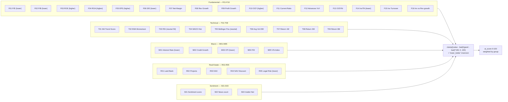
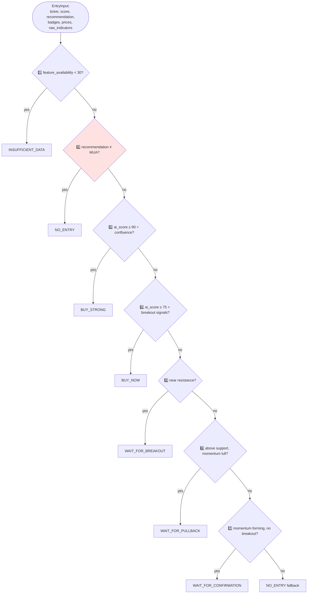
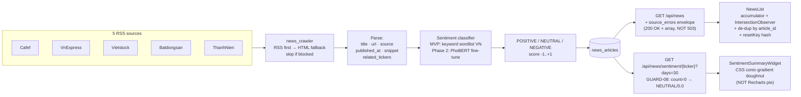
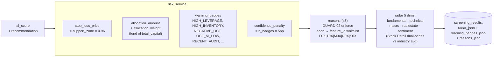

# 06 — Feature Pipeline & Engines

Pipeline screening: cache → 4 vòng lọc → feature eng → 4 engines (Score/Price/Entry/Risk) → save. Chi tiết SRS: [f01-core-screening-pipeline](../srs/), [f02-feature-engineering](../srs/), [f03-entry-point-logic](../srs/).

## End-to-end pipeline

```mermaid
flowchart LR
    Start(["POST /api/run<br/>202 PENDING"]) --> Cache{"cache fresh?<br/>g04"}
    Cache -- stale --> Warn1[set<br/>data_from_cache=true<br/>→ COMPLETED_WITH_WARNINGS]
    Cache -- fresh --> R1
    Warn1 --> R1

    subgraph Filters["4 vòng lọc — filter_service"]
        direction LR
        R1[Round 1<br/>Whitelist ~81 mã<br/>BĐS sector] --> R2[Round 2<br/>Fundamentals<br/>P/E, D/E, OCF, etc.]
        R2 --> R3[Round 3<br/>Technical<br/>volume, returns]
        R3 --> R4[Round 4<br/>Data quality<br/>missing → INSUFFICIENT_DATA]
    end

    R4 -- excluded --> ExcDB[("excluded_stocks<br/>per round")]
    R4 -- passed --> Feat

    subgraph FeatEng["Feature engineering — c02"]
        direction TB
        Feat[feature_service<br/>compute 38 features × N tickers]
        Feat --> Norm["Normalization Spec<br/>F01-F16 fundamentals<br/>T01-T09 technical<br/>M01-M05 macro<br/>R01-R05 real estate<br/>S01-S03 sentiment"]
    end

    Norm --> Engines

    subgraph Engines["Engines — c01"]
        direction TB
        Score["Scoring<br/>baseline weighted normalize<br/>→ ai_score 0-100<br/>→ MUA/GIỮ/BÁN<br/>→ confidence_raw"]
        Price["Price<br/>baseline → target_3m<br/>→ upside_pct"]
        Entry["EntryPoint<br/>deterministic<br/>SRS-03 priority order<br/>→ signal + S/R"]
        Risk["Risk<br/>stop_loss<br/>+ allocation<br/>+ warning_badges<br/>+ confidence_penalty"]
    end

    Score --> Aggregate
    Price --> Aggregate
    Entry --> Aggregate
    Risk --> Aggregate

    Aggregate["Aggregate per ticker<br/>+ reasons (≤5, GUARD-02)<br/>+ radar 5 dims"] --> SaveDB[("screening_results")]

    SaveDB --> CheckWarn{any warnings?}
    CheckWarn -- yes --> CW[COMPLETED_WITH_WARNINGS]
    CheckWarn -- no --> C[COMPLETED]

    CW --> TG{telegram_enabled?}
    C --> TG
    TG -- yes --> TGSend[Telegram send<br/>non-blocking<br/>c07]
    TG -- no --> Done
    TGSend --> Done(["Terminal — broadcast<br/>lastCompletedRunId"])
```

## 38 features — normalization (c02 §2)

## Entry signal priority (c03)

> **Step 2 critical** ([c03 §2](../tad/c03-entry-engine.md)): `rec ≠ MUA → NO_ENTRY` MUST enforce trước Step 3+. Cluster 2 prototype trả `WAIT_FOR_*` cho cả mã GIỮ/BÁN — vi phạm AC-03-02. Fix qua `decideEntrySignal` cluster 3.

## News & sentiment pipeline (c04)

## Risk + reasons (c01, c05)

## Notes

- **GUARD-02** (xem [SRS f06 Explainability](../srs/)): mỗi reason phải map đến **≥1 scoring feature hoặc risk flag** cụ thể. KHÔNG LLM-generate tự do. Cluster 2 enforce qua [`REASON_TEMPLATES`](../tad/g06-testing.md) (13 templates kèm `feature_id`).
- **GUARD-08** (xem [c04 §1.3](../tad/c04-news-sentiment.md)): `count=0 trong 30 ngày → NEUTRAL/0.0/empty breakdown`. Frontend render italic note thay vì error.
- **Anchor pattern (mock)**: VHM/KDH/NLG/DXG/PDR + 5 MOCK_* tickers cover 7-enum coverage entry signal trong UI demo (xem [c03 §2](../tad/c03-entry-engine.md), [g06 §3](../tad/g06-testing.md)).
- **Engine swap**: scoring + price là `ABC` — MVP `*_baseline.py`, target `*_xgboost.py` / `*_lstm.py`. Entry KHÔNG abstract — logic deterministic theo SRS-03.
