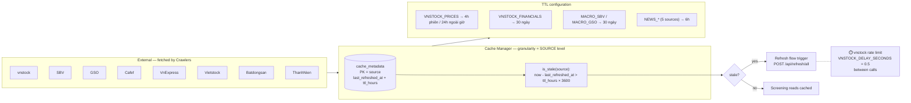
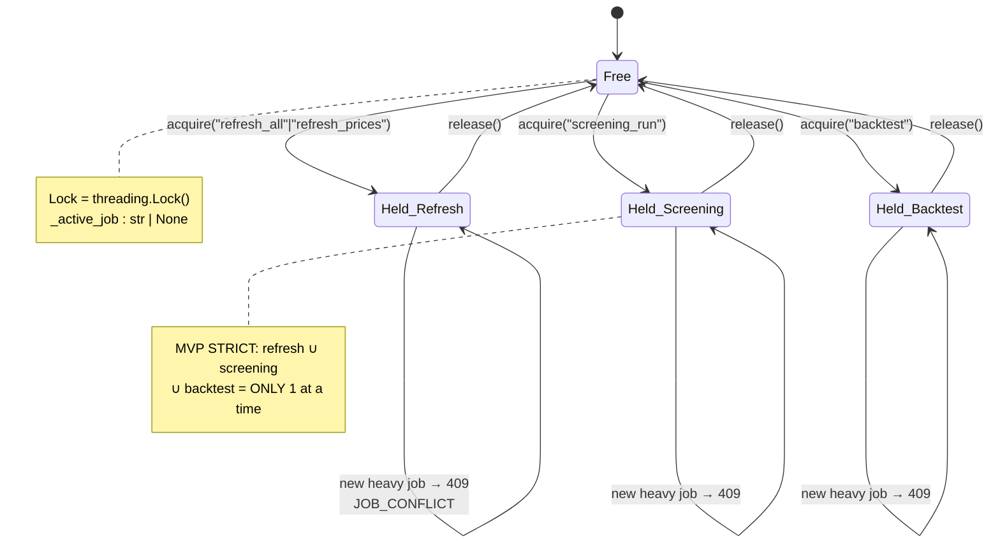
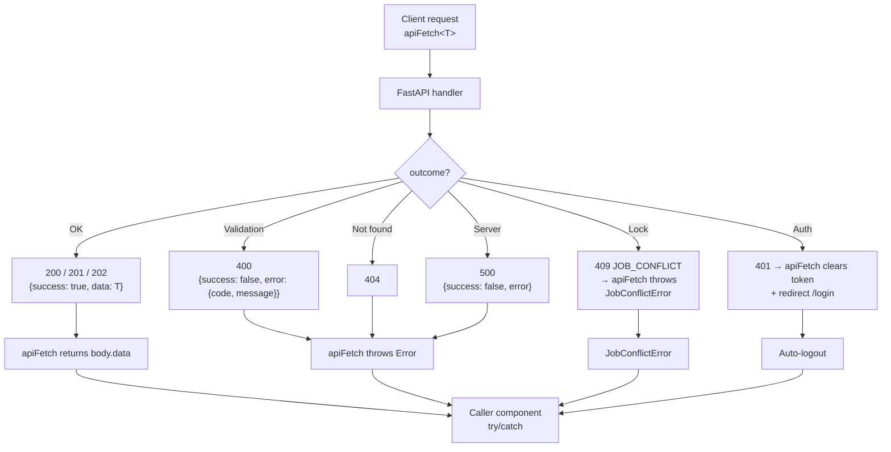
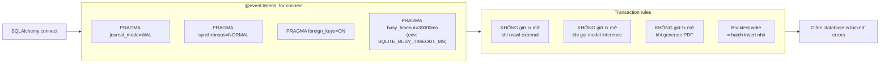
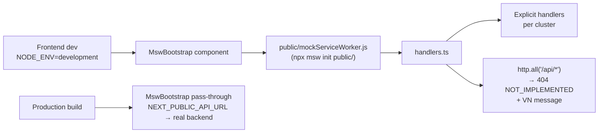

# 07 — Cache & Cross-cutting

3 cross-cutting concerns: **cache** (granularity + TTL), **job lock** (concurrency), **error envelope** (response standard).

## Cache — source-level TTL (g04)



**Granularity decision (g04 §1):**

| Aspect | MVP | Post-MVP |
|---|---|---|
| Cache key | `source` (e.g. `VNSTOCK_PRICES`) | `(source, ticker)` ticker-level |
| All ~81 tickers per source | Share TTL | Independent TTL |
| Refresh by source | All-or-nothing | Per-ticker resync |

## Job lock — single heavy job (g05 §1)



**API behavior khi lock held:**

```json
HTTP 409 CONFLICT
{
  "success": false,
  "error": {
    "code": "JOB_CONFLICT",
    "message": "Đang có tác vụ chạy: {active_job}. Vui lòng đợi hoàn thành."
  }
}
```

→ Frontend `apiFetch` catch 409 → throw `JobConflictError` → caller hiển thị toast warning (xem [g02 §5](../tad/g02-api.md)).

## Error envelope (g05 §3 + g02 §6)



**Convention chốt cluster 5/6:** DELETE endpoints trả **200 + envelope** thay vì 204 — vì `apiFetch` parse `await res.json()` (xem [g02 §8.1](../tad/g02-api.md)).

| Endpoint | Old | New |
|---|---|---|
| `DELETE /portfolio/{id}` | 204 No Content | 200 `{deleted: true}` |
| `DELETE /runs/{id}` | — (not exist) | 200 `{deleted: true}` |
| `DELETE /share/{token}` | — (not exist) | 200 `{deleted: true}` |

## SQLite hardening (g07)



## MSW dev mock boundary (g05 §5)



> Catch-all → dev thấy ngay endpoint chưa mock (toast tiếng Việt rõ ràng), thay vì silent fail. Phát hiện sớm gap mock.

## Notes

- **Cache + JobLock + Error envelope** là 3 concern chạy ngang qua mọi service. Đổi 1 trong 3 = ảnh hưởng toàn hệ thống.
- **MVP scope cứng**: 1 lệnh refresh per ngày, 1 screening tại 1 thời điểm. Beta multi-user sẽ phải nâng cấp:
  - JobLock → Redis distributed lock hoặc job queue (Celery/RQ).
  - Cache granularity → ticker-level.
  - Refresh job status → persistent table thay in-memory registry.
- **Logging**: structured JSON ghi vào `backend/logs/app.log` (xem [g05 §2](../tad/g05-cross-cutting.md)). Mỗi log entry kèm `run_id` + `module` để trace cross-service.
